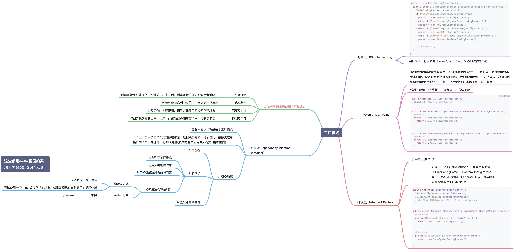
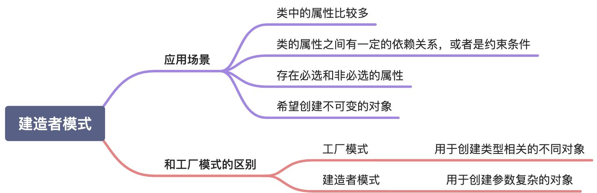
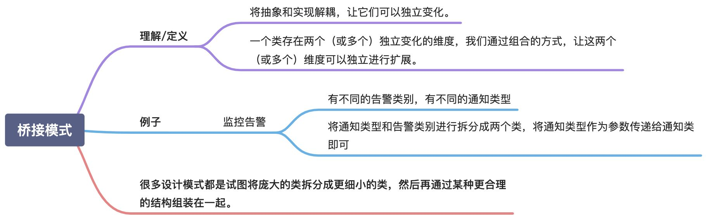
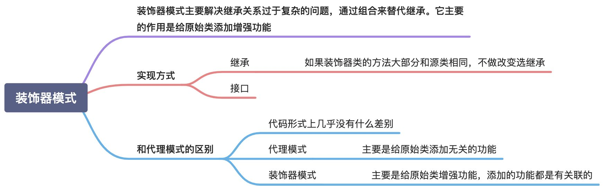
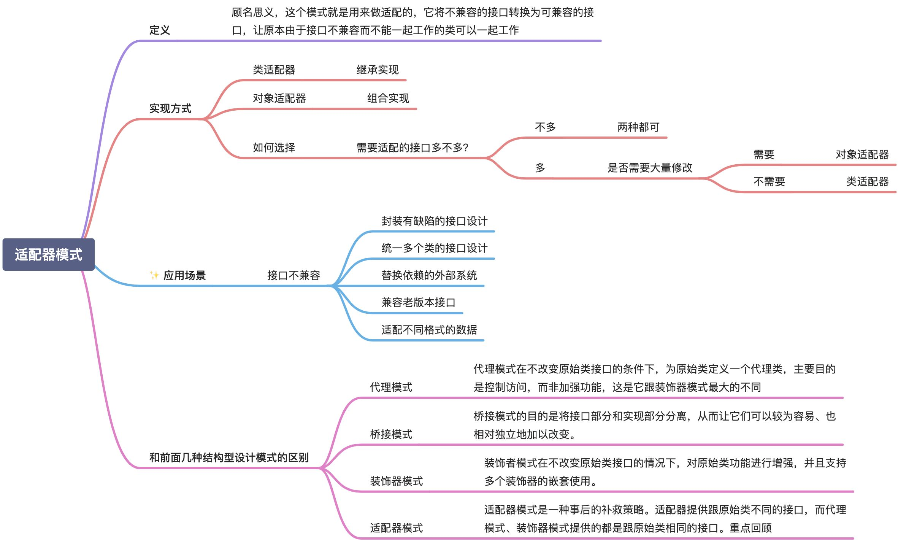
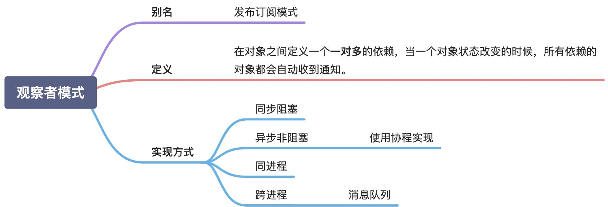
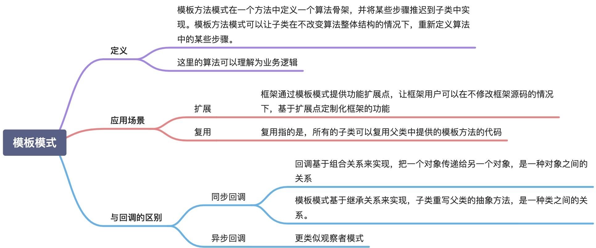

# go 设计模式

https://lailin.xyz/post/factory.html#%E5%8D%95%E5%85%83%E6%B5%8B%E8%AF%95

## 创建型

### [单例模式](singleton.go)

### [工厂模式](./factory)

### [建造者模式](builder.go)

### [桥接模式](bridging.go)

### [装饰者模式](decorator.go)

### [适配器模式](adapter.go)

### [观察者模式](observer.go)

### [模板模式](template.go)

